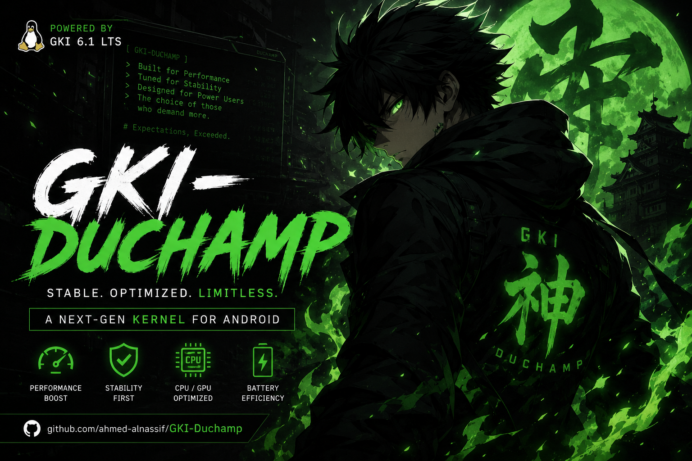

# GKID Kernel

  

A feature-rich Generic Kernel Image (GKI) kernel built for the **Poco X6 Pro (Duchamp)** and compatible with any device running a **6.1.xx-android14** GKI kernel. Designed to offer maximum flexibility, it provides multiple variants to suit your specific needs, whether you prioritize root management, system integrity, or performance.

## ✨ Key Features
*   **⚡ Performance & Efficiency Tweaks:** Extensively optimized for the Poco X6 Pro (and similar 6.1.xx-android14 devices):

    - Timer frequency set to **300Hz** for noticeably lower input lag and snappier feel

    - **Multi-Gen LRU (MGLRU)** enabled for better multitasking and battery efficiency

    - **Optimized memory operations** (memcpy, memcmp, memset) from ARM-optimized-routines for up to 50% faster string/memory handling

    - **3x faster integer square root** reducing CPU time in cpufreq calculations

    - Optimized **zRAM** with LZ4 compression + writeback + tracking for more and faster usable RAM under heavy loads

    - CPU governors: **schedutil + ondemand** for efficient yet responsive scaling

    - **mq-deadline I/O scheduler** tuned for low latency on UFS 4.0 storage

    - Network stack with **TCP BBRv3** + **TCP Westwood+** + **FQ** + **ECN** + **IPv6 HL support** + **TCP_NODELAY forced** for reduced latency and faster WiFi/mobile data speeds

    - **F2FS** filesystem tuning (reduced GC sleep to 50ms, enlarged fsync blocks, reduced congestion timeout)

    - **ext4** commit age extended to 30s for fewer disk writes

    - **IP Set** full support + **IPv6 NAT** for better tethering and VPN performance

    - **Filesystem Unicode fix** preventing crashes from invalid UTF-8 filenames on vfat/exfat

*   **🔋 Battery & Power Optimizations:**
    - Freeze timeout reduced from 20s to **1s** for faster deadlock detection
    - Global wakelock timeout capped at **500ms** to prevent infinite battery drain
    - Alarmtimer wakeup minimized using actual timer values instead of hardcoded 2s
    - Excessive s2idle wake attempts eliminated (single wake instead of multiple)
    - PCI PME check interval extended to reduce unnecessary wakeups
    - VFS cache pressure reduced to **50** for better RAM utilization
    - Cache hot buddy disabled for DynamIQ Shared Unit efficiency

*   **🧠 Scheduler & CPU Optimizations:**
    - CPU scan order adjusted for efficient idle core selection
    - Branch prediction hints optimized in cpufreq paths
    - File struct aligned to 8 bytes for better cache performance
    - Clear page aligned to 16 bytes reducing CPU time on page allocation
    - Memory prefetch optimizations for copy operations

*   **🔧 Multiple Variants:** Choose the configuration that fits your needs:
    - **Root solutions:** KernelSU, KernelSU Next, SukiSU Ultra, Wild KSU, or Vanilla (no root)
    - **Manager flexibility:** Multiple-Manager variants let you use your preferred manager app

*   **🛡️ SUSFS Integration:** Advanced kernel-level hiding and spoofing capabilities (available in dedicated variants)
*   **🔒 Baseband Guard (BBG):** Lightweight LSM that blocks unauthorized writes to critical partitions and device nodes, protecting the baseband and boot chain from tampering

## ⭐ Support the Development

If you find this kernel useful, consider showing your support:

*   **Star the Repository:** Give this project a ⭐ on GitHub to help others discover it
*   **Share:** Spread the word in your community, forums, or with fellow Poco X6 Pro users
*   **Report Issues:** Found a bug? Open an issue with detailed logs to help improve stability
*   **Contribute:** Pull requests, suggestions, and constructive feedback are always welcome

Your support helps keep this project maintained and improved for everyone.

## 🧩 Recommended Modules for Poco X6 Pro

Enhance your device with these companion modules:

| Module | Description |
|--------|-------------|
| [**Thermal Manager**](https://github.com/ahmed-alnassif/Thermal-Manager) | Fixes the thermal mode/profile reset issue on Poco X6 Pro. Monitor and force-persist your chosen mode: **Balanced** ⚖️, **Battery Saver** 🔋, **Performance** ⚡, or **Gaming** 🎮. Includes **WebUI** for instant switching, auto battery saver when screen off, and mode persistence after reboot. |
| [**DSP AudioFix**](https://github.com/ahmed-alnassif/DSP-AudioFix) | Simple fix for distorted audio on Poco X6 Pro and similar Xiaomi/MediaTek devices with Awinic smart amps. |

>[!TIP]
>Both modules are designed specifically for Poco X6 Pro hardware quirks and work seamlessly with any GKID kernel variant.

## 📱 Compatibility
*   **Primary Device:** Poco X6 Pro (codenamed `duchamp`)

*   **GKI Requirement:** Flashes on any device with a **6.1.xx-android14** kernel.  
    *(Note: Only tested on the Poco X6 Pro. Please exercise caution on other devices.)*

## ⬇️ Downloads
Find the latest builds for all variants in the [Releases](https://github.com/ahmed-alnassif/GKI-Duchamp/releases) section.

## 🐧 Kernel Source
**GitHub:** [ahmed-alnassif/GKI-Duchamp-6.1](https://github.com/ahmed-alnassif/GKI-Duchamp-6.1)

